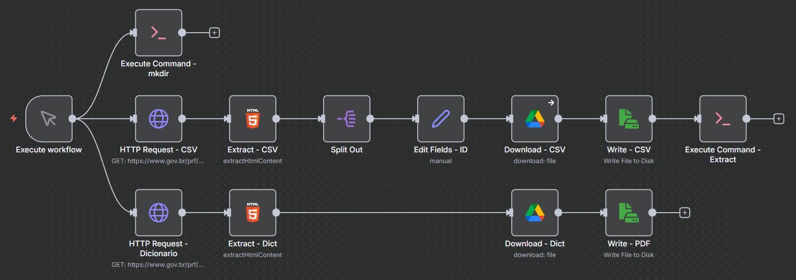
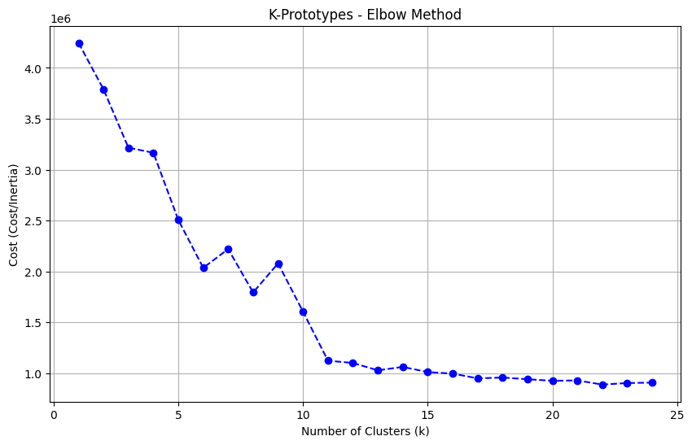
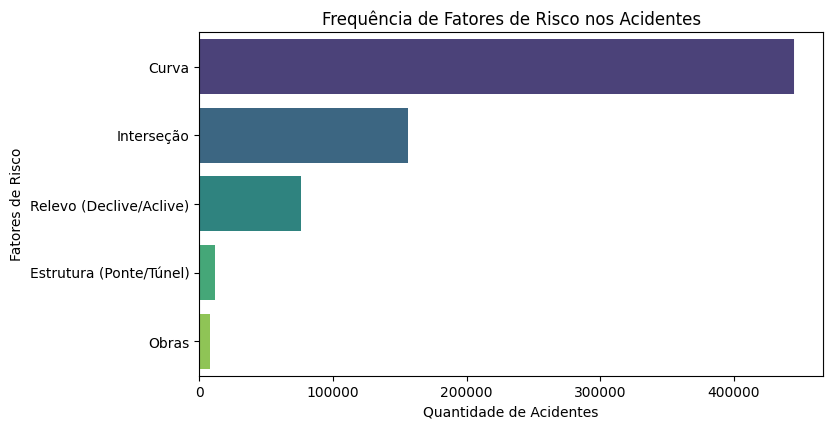
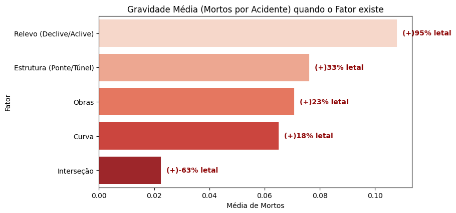
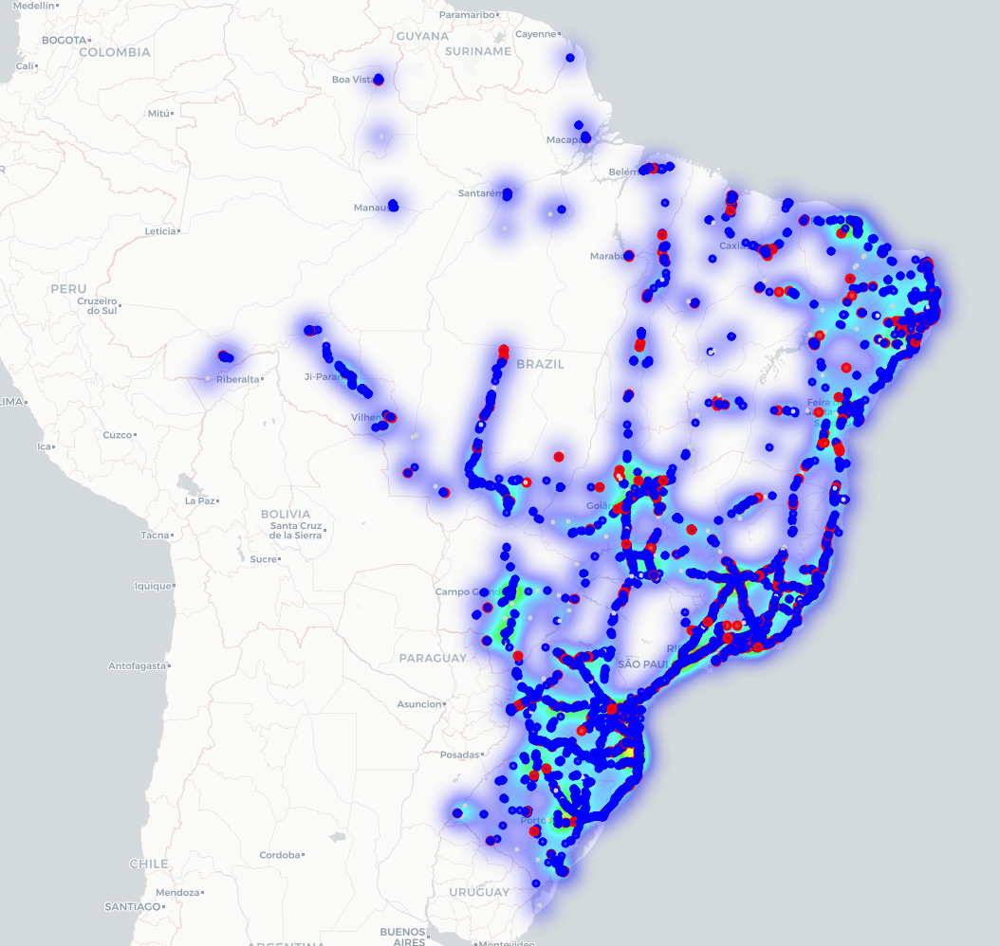
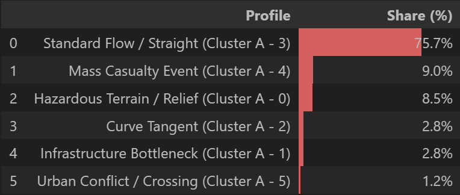
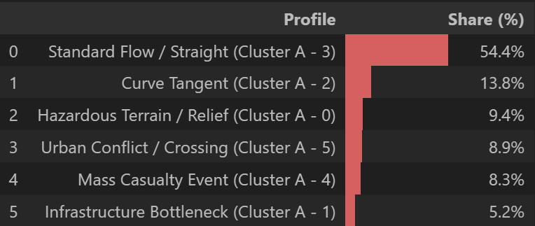

# PRF Accident Clustering
**Análise Comportamental e Geoespacial de Acidentes Rodoviários Federais (2007-2024)**

Este repositório contém um projeto de Ciência de Dados *end-to-end* que aplica técnicas de aprendizado não-supervisionado para identificar padrões de acidentalidade nas rodovias federais brasileiras. O projeto utiliza um pipeline automatizado de Engenharia de Dados para processar 18 anos de dados públicos da Polícia Rodoviária Federal (PRF), superando desafios de inconsistência de *schema* e dados legados.

## Tópicos
- [Visão Geral e Objetivos](#visão-geral-e-objetivos)
- [Arquitetura da Solução](#arquitetura-da-solução)
- [Engenharia de Dados (ETL)](#engenharia-de-dados-etl)
- [Metodologia de Clusterização](#metodologia-de-clusterização)
- [Resultados: Perfis e Hotspots](#resultados-perfis-e-hotspots)
- [Como Executar o Projeto](#como-executar-o-projeto)
- [Estrutura de Arquivos](#estrutura-de-arquivos)
- [Autor](#autor)

## Visão Geral e Objetivos
A segurança viária é um desafio crítico no Brasil. O objetivo deste trabalho é ir além das estatísticas descritivas básicas e responder a duas perguntas fundamentais:
1.  **O QUE acontece?** (Quais são os perfis típicos de acidentes?)
2.  **ONDE acontece?** (Onde estão os pontos de alta letalidade?)

Para isso, utilizamos algoritmos de *Machine Learning* para segmentar os acidentes em grupos comportamentais e identificar *hotspots* geográficos de risco.

## Arquitetura da Solução
A solução foi construída sobre três pilares:
1.  **Ingestão Automatizada:** Uso de *n8n* e *Docker* para orquestrar o download e extração de dados brutos.
2.  **Harmonização de Dados:** Scripts Python para unificar *schemas* divergentes (2007-2016 vs. 2017-2024) e tratar dados nulos.
3.  **Modelagem Híbrida:** Uso de *K-Prototypes* para dados tabulares mistos e *DBSCAN* para dados geoespaciais.

## Engenharia de Dados (ETL)
O processo de ETL foi desenhado para ser resiliente e escalável. A ferramenta *n8n* foi utilizada para criar um fluxo visual que realiza o *scraping* do portal de dados abertos, baixa os arquivos ZIP anuais, extrai os CSVs e os organiza em um *Data Lake* local.



*Figura 1: Pipeline de orquestração no n8n.*

**Desafios Superados:**
* **Schema Drift:** Os dados anteriores a 2017 não possuíam coordenadas geográficas padronizadas e utilizavam separadores decimais diferentes.
* **Qualidade dos Dados:** Tratamento extensivo de campos de texto livre (ex: "Falta de Atenção" vs "falta de atencao") e remoção de coordenadas inválidas (pontos fora do Brasil).

## Metodologia de Clusterização
A análise foi dividida em duas frentes complementares:

### Cluster A: Análise Comportamental
Utilizou-se o algoritmo **K-Prototypes** para agrupar acidentes com base em características mistas (numéricas e categóricas), como tipo de pista, clima, horário e severidade. O número ideal de clusters (K=6) foi determinado pelo Método do Cotovelo (*Elbow Method*).



*Figura 2: Definição do número ideal de clusters.*

### Cluster B: Análise Geoespacial
Utilizou-se o algoritmo **DBSCAN** com distância de Haversine para identificar aglomerados de alta densidade (*hotspots*) ao longo das rodovias. Diferentes cenários foram testados:
* **Micro (0.2km):** Para detectar curvas ou pontos específicos de alta letalidade.
* **Macro (5.0km):** Para identificar regiões metropolitanas ou trechos longos de saturação.

## Resultados: Perfis e Hotspots

### 1. Fatores de Risco e Infraestrutura
Antes da clusterização, analisamos como a infraestrutura impacta a gravidade. Os dados mostram que a geometria da via é determinante para a chance de sobrevivência.

Embora curvas e interseções sejam locais frequentes de acidentes, o risco de morte explode (+95%) em trechos de relevo (serras) e pontes/túneis (+33%), onde a área de escape é inexistente.



*Figura 3: Distribuição dos clusters de acidentes na malha viária brasileira.*




*Figura 4: Gravidade dos tipos de acidentes quando o fator em questão existe.*


### Taxonomia dos Acidentes (Cluster A)

Utilizando o algoritmo K-Prototypes, segmentamos os acidentes em 6 perfis comportamentais. Três deles contam a história principal da segurança viária no Brasil:


**Foram identificados 6 perfis distintos de acidentes:**


| ID | Perfil (Cluster)            | Frequência | Letalidade | Característica Básica |
|----|-----------------------------|------------|------------|------------------------|
| 0  | Risco do Relevo             | 3.4%       | Média/Baixa| Acidentes em serras e declives (ex.: saída de leito em relevo).       |
| 1  | Gargalo de Obra             | 0.9%       | Baixa      | Ocorrências em desvios/estreitamento de pista (obras/desvios).        |
| 2  | A Tangente da Curva         | 19.3%      | Média      | Saídas de pista em curvas; fator geométrico dominante.                |
| 3  | O Acidente Padrão           | 63.9%      | Baixa      | Colisões traseiras em retas; problema de fluxo e atenção.            |
| 4  | Tragédia de Massa           | 5.4%       | Altíssima  | Múltiplos veículos e vítimas; letalidade ~4x a média.                 |
| 5  | Conflito Urbano             | 7.1%       | Média      | Colisões transversais em cruzamentos (áreas urbanas).                |


**Clusters de maior interesse:**

| ID | Perfil (Cluster)       | Frequência | Letalidade | Característica Básica |
|----|-------------------------|------------|------------|------------------------|
| 2  | A Tangente da Curva     | 19.3%      | Média      | Saídas de pista em curvas; comportamento 100% associado à geometria da via. |
| 3  | O Acidente Padrão       | 63.9%      | Baixa      | Colisões traseiras leves em retas e tempo bom; problema de fluxo e atenção. |
| 4  | Tragédia de Massa       | 5.4%       | Altíssima  | Poucos casos, mas com múltiplos veículos e letalidade 4x maior que a média. |


### Mapeamento de Hotspots (Cluster B)
A análise geoespacial com DBSCAN permitiu diferenciar "Gargalos Logísticos" de "Armadilhas Mortais" através de diferentes níveis de zoom (Micro e Macro).



*Figura 5: Distribuição dos clusters. Pontos vermelhos indicam presença de vítimas fatais.*

- **O Insight "Micro" (Raio 0.2 km):**
  - **Local:** O ponto exato mais letal do Brasil não é uma curva de serra sinuosa, mas uma reta urbana na BR-116 (SP), Km 207.
  - **Acidentes:** > 7.241.
  - **Mortes:** 278 (3.8%).
  - **Diagnóstico:** A “Análise de DNA” deste ponto revelou que 75% dos acidentes são do tipo “Padrão/Reta”.  
    Isso mostra que a combinação de **alto volume + alta velocidade em área urbana** é mais fatal do que a geometria complexa da via.




*Figura 6: Decomposição Comportamental e do perfil do Hotspot Mais Letal (BR-116/SP - Km 207).*

- **O Insight "Macro" (Raio 5.0 km):**
  - **Local:** A região mais caótica do país é o trecho da BR-101 (SC), Km 169.
  - **Acidentes:** 72.943 (Concentração massiva).
  - **Mortes:** 2.904 (4.0%).
  - **Diagnóstico:** Um gargalo logístico e turístico que trava o estado, caracterizado por saturação da via e obras constantes.



*Figura 7: Decomposição Comportamental e do perfil do Hotspot Mais Caótico (BR-101/SC - Km 169).*

## Como Executar o Projeto

### Pré-requisitos
* Docker e Docker Compose
* Python 3.10+
* Jupyter Notebook

### Passo 1: Iniciar o Pipeline de Dados (n8n)
O ambiente de orquestração (n8n + Postgres) é containerizado. Na raiz do projeto, execute o comando para construir e subir os serviços:

```bash
docker compose up --build -d
```

Após a inicialização, acesse a interface do n8n em:

http://localhost:5678

#### Configuração do Workflow:

No n8n, vá em "Workflows" > "Import from File".

Selecione o arquivo localizado em workflows/prf_downloader.json.

Ative e execute o workflow para iniciar o download dos dados para a pasta data/raw.

### Passo 2: Executar as Análises (Jupyter)
Com os dados baixados, execute os notebooks na seguinte ordem:

analytics.ipynb: Realiza a limpeza, harmonização e gera o arquivo df_final_processed.pkl.

cluster_A.ipynb: Executa o K-Prototypes e gera os perfis comportamentais.

cluster_B.ipynb: Executa o DBSCAN, gera os mapas HTML e realiza a análise cruzada (DNA do Hotspot).

## Estrutura de Arquivos

```
	PRF-Accident-Clustering/
	│
	├── arquivos_prf/
	│   ├── raw/					# Arquivos ZIP originais (Baixados pelo n8n)
	│   ├── csv/					# Arquivos CSV (Extraídos pelo n8n)
	│   └── dict/					# Dicionário dos dados (Baixados pelo n8n)
	│
	├── data/
	│   ├── .pkl/					# Arquivos Pickle ou ZIPs se disponível (Processados pelo analytics.ipynb e Cluster A)
	│   └── maps/					# Mapas HTML (Gerados pelo Cluster B)
	│
	├── img/						# Imagens para documentação
	│
	├── scripts/
	│   ├── analytics.ipynb			# ETL e Engenharia de Features
	│   ├── cluster_A.ipynb			# Modelagem Comportamental
	│   └── cluster_B.ipynb			# Modelagem Geoespacial
	│   └── decompress.py			# Script usado pelo n8n (Para descompressão correta dos arquivos)
	│
	├── view/
	│   ├── .html					# Recorte da página da PRF para visualização para extração dos links
	│
	├── workflows/
	│   └── prf_downloader.json		# Workflow do n8n exportado
	│
	├── docker-compose.yml			# Configuração do ambiente n8n
	│
	└── README.md					# Esse arquivo
```

## Autor

Vinícius Santos Monteiro
* [GitHub - Projeto PRF - Accident Clustering](https://github.com/vini-mon/PRF-Accident-Clustering)

* [LinkedIn](https://www.linkedin.com/in/vinicius-santos-monteiro-a3a88a1aa/)


---
